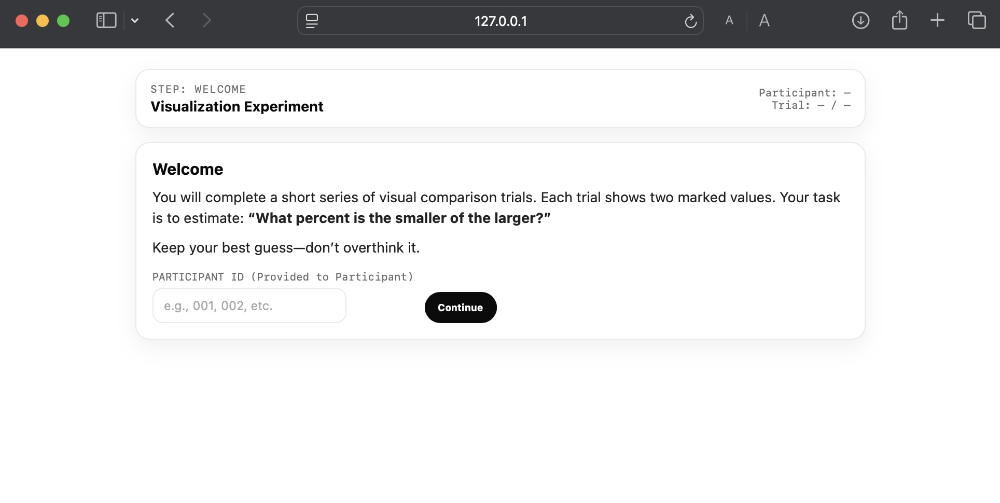
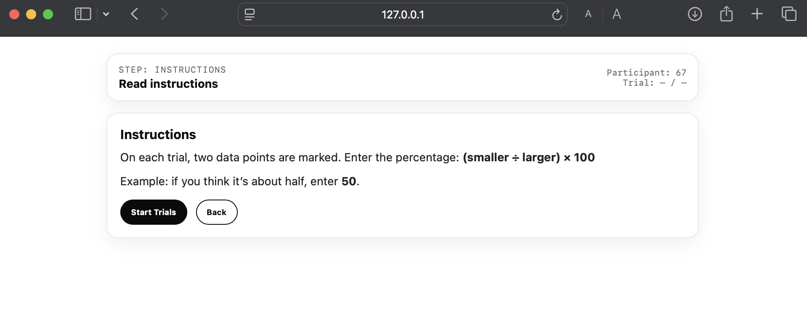
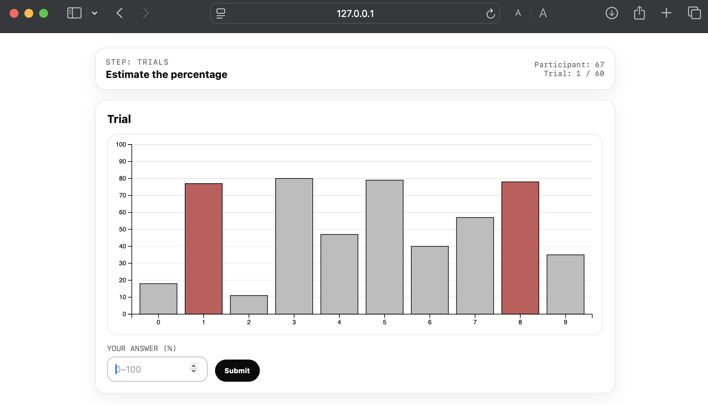
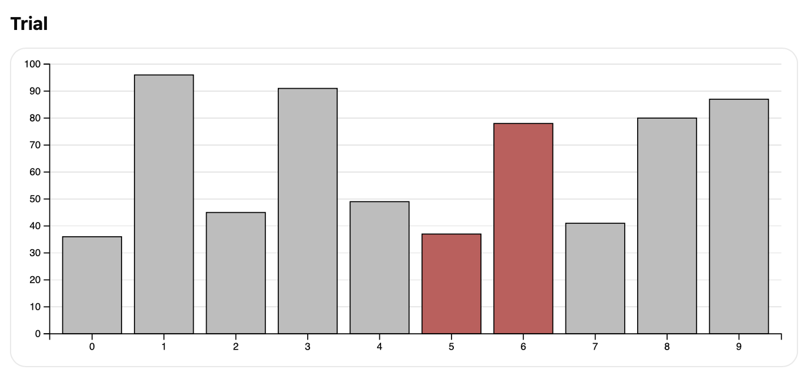
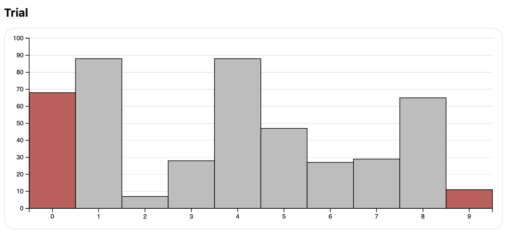
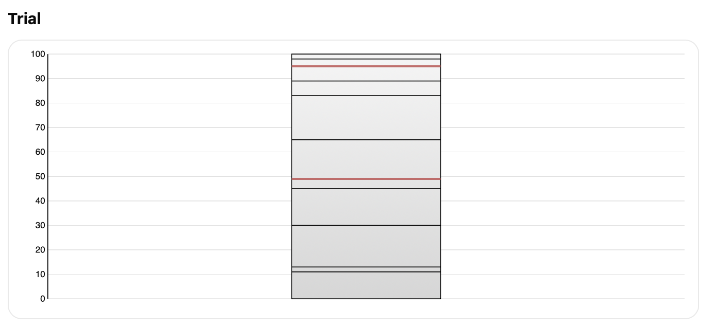
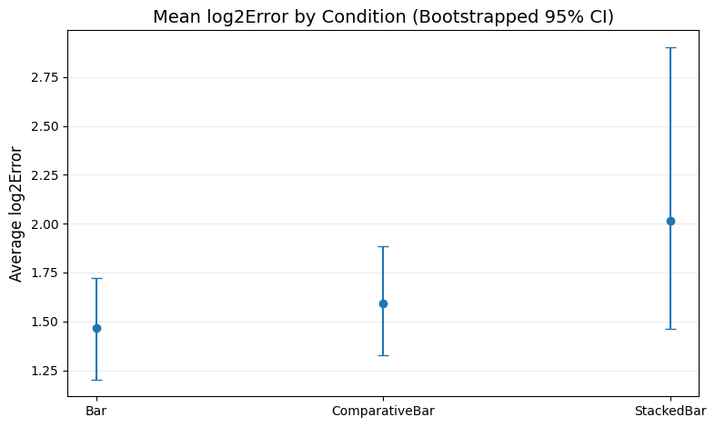
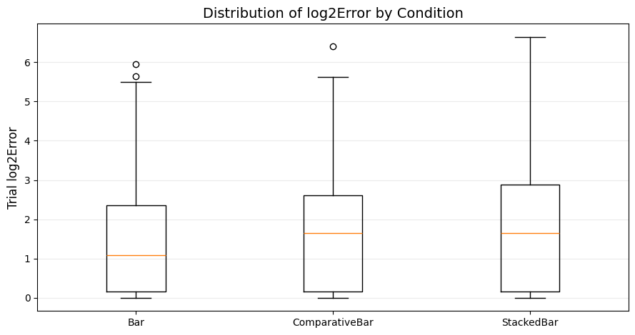
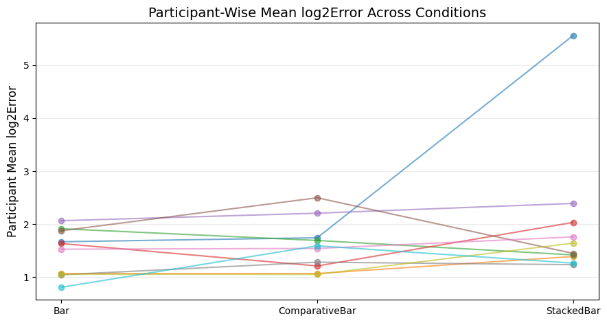
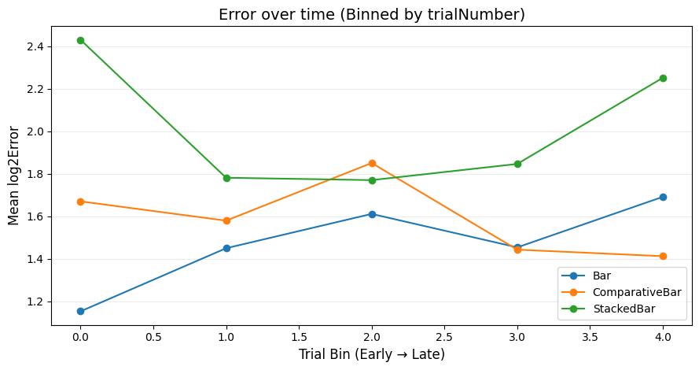

Assignment 3 - Replicating a Classic Experiment  
===

## Link
- **GitHub Pages Link:** https://diwakarsandhu1.github.io/a3-experiment/
- **Repository Link:** https://github.com/diwakarsandhu1/a3-experiment

## Overview
In this project, we recreated a controlled visualization experiment inspired by Cleveland & McGill (1984) and later replications. Participants completed a sequence of randomized trials where two values in a chart were marked and they estimated **"what percent is the smaller of the larger?"**. We comparied the accuracy across three visualization conditions: Bar, Comparative Bar, and Stacked Bar. Responses were graded by computeing the true percent against the reported percent for each trial using the Cleveland-McGill log-base-2 error metric.

## Experiment Screenshots

## Conditions (Visualizations Tested)
**Overall Goal:** To test how visualization design affects ratio-judgement accuracy, with our overall hypothesis being that the closer the two marked values are spatially because of the type of visualization, the easier it is to compare their lengths and estimate the ratio, leading to a lower log2error.

### 1. Bar Chart
**Hypothesis:** Participants will be the least accurate in this condition because although the marked values are shown as simple heights/lengths from a common baseline, they can be spatially far away because of the distance between the bars, making it difficult to calculate the ratio between the smaller and larger.

### 2. Comparative Bar Chart
**Hypothesis:** Participants will be more accurate in this condition than Bar because the marked values are still shown as simple heights/lengths from a common baseline, but we make them spatially closer by removing the gaps.

### 3. Stacked Bar Chart
**Hypothesis:** Participants will be the most accurate in this condition because the values are stacked on top of each other, making it easier to gauge the ratio of the smaller marked value to the larger.

## Procedure
- 60 trials per participant (20 trials per condition)
- Randomized trial order to ensure conditions were shown randomly
- 10 total participants -> 200 trials per condition
- Participants would enter a whole percent from 0 to 100

## Data Generation
- Each trial is generated by: randomly choosing 10 values in the range 0 to 100 and choosing 2 random marked values by index
- There are 20 trials generated per condition and then the order is shuffled
- Each visualization is then generated based off the data for the trial

## Error Metrics
- **TruePercent** = round((smaller/larger) * 100)
- **ReportedPercent** = rounded whole % input
- **log2error** = log2(|ReportedPercent - TruePercent| + 1/8)
- **Special Error Case:** if ReportedPercent == TruePercent, set Error to **0** (instead of log2(1/8) = -3)

## Output Data
The experiemnt logs one row per trial in a CSV-ready format. Each row contains the participant ID, trial number, visualization condition, the generated data values, the indices of the marked values, the participant's report percentage, the computed true percent, and the resulting log2error. At the end of a participants's trials, the CSV can be copied and appended to a master dataset combining all participants and trials.

## Figures

### Figure 1 (Mean Log2Error by Condition, Bootstrapped 95% CI)

Mean log2Error for each visualization condition, aggregated across all participants and trials. Error bars show bootstrapped 95% confidence intervals, and the conditions are ordered from lowest to highest mean error. Bar has the lowest average error, ComparativeBar is slightly higher, and StackedBar is highest with the widest uncertainty.

### Figure 2 (Distribution of log2Error by Condition)

Boxplots show the distribution of trial-level log2Error for each condition, showing medians, IQR, and outliers. Bar and ComparativeVar have similar central tendency and spread, while StackedBar has greater variability and more high-error trials. This suggests that the stacked chart is less stable and more error-prone.

### Figure 3 (Participant-wise Mean log2Error Across Conditions)

Each line represents a participant's mean log2Error in each condition, showing individual differences and whether the overall pattern holds across people. Most participants show relatively similar performance on Bar and ComparativeBar, with more error on StackedBar. 

### Figure 4 (Error Over Time, Binned by Trial Number)

Mean log2Error over the course of the experiment with trials grouped into bins, representing trials from early to late for each condition. The trends are not strongly consistent across conditions, meaning that there is limited evidence of a uniform learning or fatigue effect. Small shifts across bins may reflect nosie or participant-specific strategies rather than a universal time effect.

## Results
We collected 600 total trials (200 per condition) from 10 participants. Figure 1 above shows the mean log2Error per condition with bootstrapped 95% confidence intervals. Overall, **Bar** performed best, followed by **ComparativeBar**, and then **StackedBar**.
- **Bar:** Mean log2Error = 1.47 (95% CI [1.20,1.72])
- **ComparativeBar:** Mean log2Error = 1.59 (95% CI [1.33, 1.89])
- **StackedBar:** Mean log2Error = 2.01 (95% CI [1.46, 2.90])

Bar and ComparativeBar are relatively close in performace and their confidence intervals overap, meaning that the difference between them is small. However, StackedBar shows noticabely higher average error and a much wider confidence interval, indicating both poorer performance and greater variability.

One important factor that may have influences performance is that our charts included y-axis tick marks and gridlines, which encouraged some participants to compute the ratio using the axis rather than relying purely on visual perception of proportion. We heard mixed strategies across participants, roughly split 50/50 between using the visual proportions vs using the axis as a measuring tool. However, we also received feedback that the ComparativeBar condition made this math-approach harder, because it was difficult to visually trace a bar's height across the y-axis.

Our original hypothesis also was not fully supported. We expected StackedBar to produce the lowest error because it seems like it should "naturally" communicate proportions. Instead, StackedBar produced the highest error, and participant feedback showed that the stacked encoding was more confusing than expected. Even if the design looks like it should emphasize proportion, it was difficult for participants to understand. 

For future iterations, we would adjust the design to better isolate visual judgement from measurement. For example, we would remove or greatly reduce y-axis tick marks/gridlines so participants cannot easily read values, and redesign how we mark values and lay them out (especially for StackedBar) to make the comparisons unambiguous. This would better test perceptual accuracy of the visual encodings themselves, rather than a 50/50 split of visual estimation and axis-based calculation. 

## Technical Achievements
- Multi-screen experiemnt flow (Welcome -> Instrictions -> Trials -> Results)
- Randomized trial generation
- Keyboard submits, progess indicator, etc.
- Response validation, logging, and CSV output

## Design Achievements
- D3 rendering for three separate visualizations
- Clear markings with red color
- Consistent scale across conditions

## References
- Cleveland & McGill (1984)
- Heer & Bostock (2010 replication)
